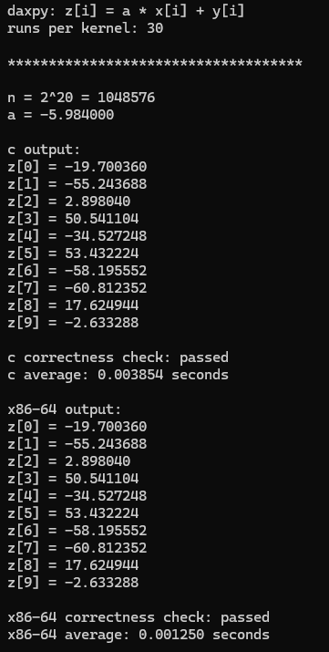
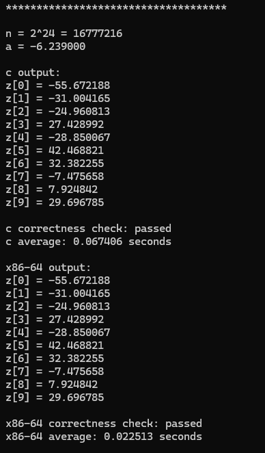
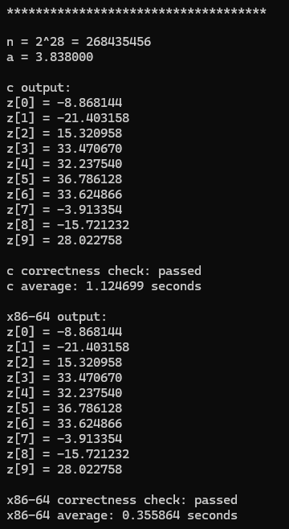
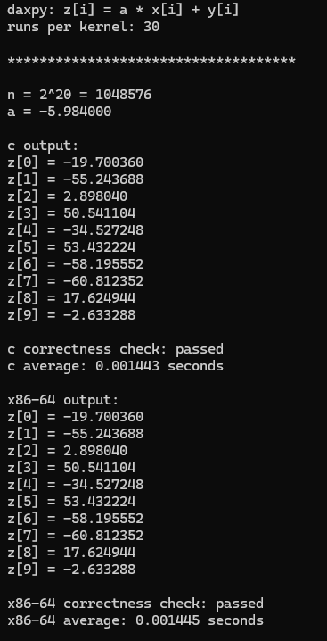
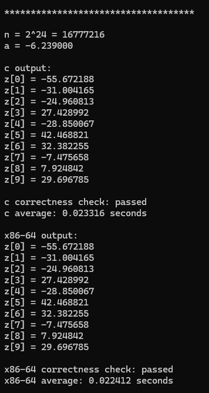
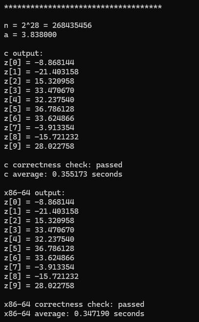

# MP2 x86-to-C Interface Programming Project

Made by: Luis Andre P. Vito - LBYARCH_S25B 

## Project Overview

This project implements the DAXPY operation using two kernel versions:

1. C
2. x86-64 assembly using scalar SIMD floating-point instructions

The operation performed is:

```text
Z[i] = A * X[i] + Y[i]
```

where:

- `n` is the length of the vectors;
- `A` is a double-precision scalar;
- `X`, `Y`, and `Z` are double-precision vectors.

The C implementation serves as the reference version. The x86-64 result is checked against the C result to verify correctness.

## Video Demonstration

[Click Here](https://drive.google.com/file/d/17OMiD90le69vIMnfZYQybHaz9cTkGwCP/view?usp=sharing)

## Test Configuration

The following vector sizes were tested:

- `2^20`
- `2^24`
- `2^28`

Random double-precision values were used for scalar `A` and vectors `X` and `Y`.

Only the first ten elements of `Z` are displayed, but the entire vector is processed.

## Performance Results

### Debug Mode

| Vector size | C average | x86-64 average | x86-64 speedup |
|---|---:|---:|---:|
| `2^20` | 0.003854 s | 0.001250 s | 3.083x |
| `2^24` | 0.070484 s | 0.020999 s | 3.357x |
| `2^28` | 1.124699 s | 0.355864 s | 3.160x |

### Release Mode

| Vector size | C average | x86-64 average | x86-64 speedup |
|---|---:|---:|---:|
| `2^20` | 0.001384 s | 0.001374 s | 1.007x |
| `2^24` | 0.023316 s | 0.022412 s | 1.040x |
| `2^28` | 0.379363 s | 0.360273 s | 1.053x |

The speedup was calculated using:

```text
C average execution time / x86-64 average execution time
```

## Performance Analysis

As shown in the table above, the x86-64 implementation was considerably faster than the c version. The more the size increases, the larger the difference in speed is present. Comparing Debug Mode and Release Mode, we can see that the Debug mode is faster overall. This is due to less optimization to the C code, as opposed to the x86-64 version being able to directly perform operations. 

In Release mode, the C and x86-64 implementations produced similar execution times. At `2^20`, the speedup rate was `1.007x`, and at `2^24` and `2^28`, the x86-64 implementation was approximately `1.052x` and `1.023x` faster, respectively.

The differences within the Release mode being smaller means that the compiler being more optimized allows the C version to be more efficient.

As for the vectors, its performance is affected depending on the size it is assigned. The bigger it gets, the more memory and cache is used for performance.

In conclusion, x86-64 has a larger advantage in speed compared to the C version when used in Debug Mode as opposed to being used in Release Mode.

## Program Output

### Debug Mode

<details>
<summary><strong>Debug — 2^20</strong></summary>



</details>

<details>
<summary><strong>Debug — 2^24</strong></summary>



</details>

<details>
<summary><strong>Debug — 2^28</strong></summary>



</details>

### Release Mode

<details>
<summary><strong>Release — 2^20</strong></summary>



</details>

<details>
<summary><strong>Release — 2^24</strong></summary>



</details>

<details>
<summary><strong>Release — 2^28</strong></summary>



</details>

